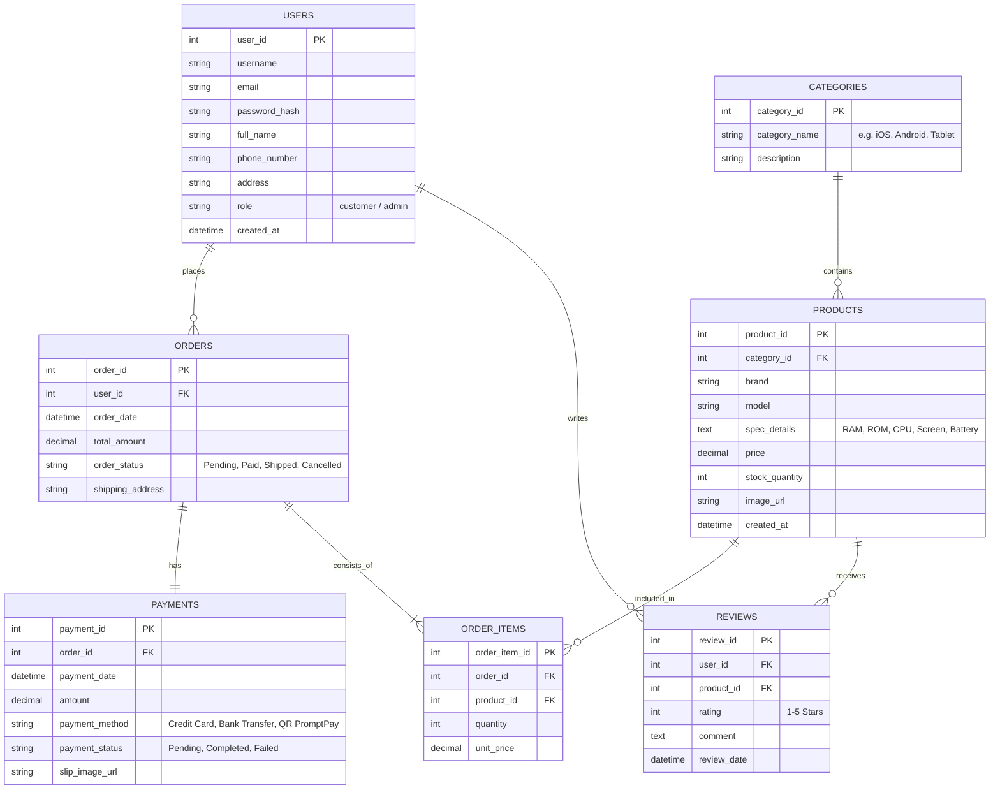

# 📱 PhoneHub - E-Commerce Platform

## 🛠 System Architecture & Diagrams

### 1. Use Case Diagram

```mermaid
graph TD
    %% User Management & Auth
    subgraph User Management & Authentication
        UC1[สมัครสมาชิก / ลงทะเบียน]
        UC2[เข้าสู่ระบบ / ออกจากระบบ]
        UC3[จัดการข้อมูลส่วนตัว]
    end

    %% Phone Catalog & Browsing
    subgraph Catalog & Search
        UC4[ค้นหาสินค้า / ฟิลเตอร์ / จัดอันดับยอดนิยม]
        UC5[ดูรายละเอียดโทรศัพท์]
        UC6[เปรียบเทียบสเปกโทรศัพท์]
    end

    %% Order & Cart Management
    subgraph Shopping Cart & Checkout
        UC7[จัดการตะกร้าสินค้า]
        UC8[ทำการสั่งซื้อสินค้า]
        UC9[ชำระเงิน]
        UC10[ติดตามสถานะคำสั่งซื้อ]
    end

    %% Review & Rating
    subgraph Feedback & Reviews
        UC11[ให้คะแนนและรีวิวสินค้า]
    end

    %% Admin Management
    subgraph Admin Operations
        UC12[จัดการข้อมูลสินค้าและสต็อก]
        UC13[จัดการคำสั่งซื้อ]
        UC14[จัดการข้อมูลผู้ใช้งาน]
        UC15[ระบบ Report และแดชบอร์ดสรุปข้อมูล]
    end

    %% Actors
    Customer((ลูกค้า / User))
    Admin((ผู้ดูแลระบบ / Admin))

    %% Connections
    Customer --> UC1
    Customer --> UC2
    Customer --> UC3
    Customer --> UC4
    Customer --> UC5
    Customer --> UC6
    Customer --> UC7
    Customer --> UC8
    Customer --> UC9
    Customer --> UC10
    Customer --> UC11

    Admin --> UC2
    Admin --> UC12
    Admin --> UC13
    Admin --> UC14
    Admin --> UC15
```

### 2. Entity Relationship Diagram (ERD)


### 3. Sequence Diagram (Checkout & Payment Flow)

```mermaid
sequenceDiagram
    autonumber
    actor User as ลูกค้า (Customer)
    participant Web as PhoneHub Store (Frontend)
    participant API as Backend Server / API
    participant DB as Database
    participant Pay as Payment Gateway

    User->>Web: เลือกโทรศัพท์และกด "เพิ่มลงตะกร้า"
    Web->>Web: อัปเดตรายการสินค้าในตะกร้า
    User->>Web: กด "ดำเนินการชำระเงิน" (Checkout)
    Web->>API: POST /api/orders (รายการสินค้า, ที่อยู่จัดส่ง)
    API->>DB: บันทึกข้อมูลคำสั่งซื้อ (Status: Pending)
    DB-->>API: คืนค่า Order ID
    API-->>Web: สรุปยอดเงิน และส่ง URL/QR ชำระเงิน

    User->>Web: ดำเนินการชำระเงิน (สแกน QR / บัตรเครดิต)
    Web->>Pay: ทำรายการชำระเงิน
    Pay-->>Web: ผลการชำระเงิน (Success)
    Web->>API: POST /api/payments/verify (ข้อมูลชำระเงิน / Slip)
    
    API->>DB: อัปเดตสถานะการชำระเงิน (Payment: Completed)
    API->>DB: ตัดสต็อกสินค้าใน PRODUCTS
    API->>DB: อัปเดตสถานะคำสั่งซื้อ (Order: Paid)
    DB-->>API: ยืนยันการอัปเดตข้อมูลสำเร็จ
    
    API-->>Web: แจ้งผลการสั่งซื้อสำเร็จ
    Web-->>User: แสดงหน้ายืนยันคำสั่งซื้อ (Order Confirmation)
